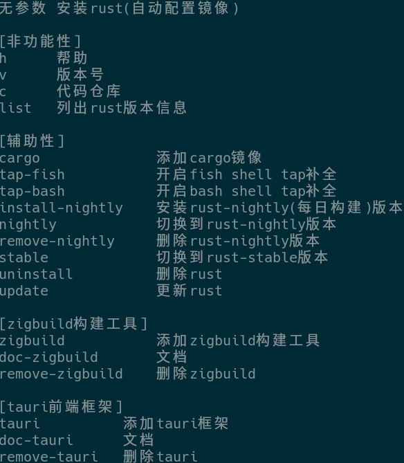

# 介绍

新手友好的rust管理工具,可以简单的安装并管理rust

# 开发环境

平台: x64

系统: Arch Linux

rust版本: 1.88.0

ide: Rust Rover

# 已知问题

只支持linux

早期版本,功能较少,后期会根据需求新增功能

# 功能介绍

# 使用帮助

下载好预编译版本后执行 **sudo cp 程序位置 /usr/local/bin/** 即可完成安装

不会安装可以看看教程视频: https://www.bilibili.com/video/BV1kwuczVEJu/